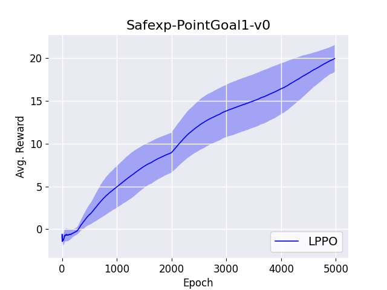
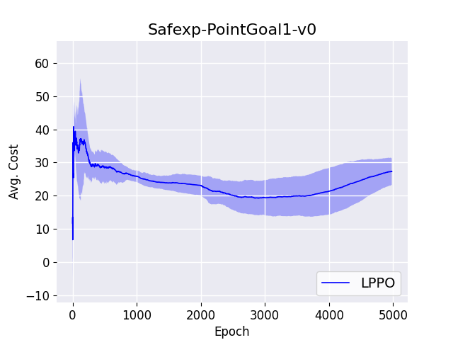

# Lagrangian-PPO
 
This repository contains the Lagrangian implementation of the Proximal Policy Optimization (PPO) [1] algorithm for Constrained Deep Reinforcement Learning (DRL). The proposed implementation provides an easy-to-understand code (an algorithm relies only on dependencies in its folder), written in Tensorflow 2.

This repository is constantly being updated and represents a baseline for Constrained DRL research.
It contains implementation of the following constrained policy-gradient algorithms:

* Lagrangian-PPO [2]

### Results

The proposed approaches are evaluated over different seeds in the SafetyGym-PointGoal1 navigation task.
Follows the plots of average cost and reward, smoother over 200 epochs. Notice that we considered standard hyperparameters for our evaluation, as in the original implementation.

  
  

### Requirements

* Python 3.x
* Installing the following packages:
	* Tensorflow 2, h5py, Yaml, Numpy, MuJoCo, Gym, SafetyGym
 
### Train the value-based algorithms

- Clone this repo to your local machine using `git clone ...`.
- Edit the `config.yml` file with your hyperparameters or desired environment
- Train the DRL approach using the `main.py` script.

## References

[1] [Proximal Policy Optimization Algorithms](https://arxiv.org/abs/1707.06347)
[2] [Benchmarking Safe Exploration in Deep Reinforcement Learning](https://cdn.openai.com/safexp-short.pdf)

## License

- **MIT license**